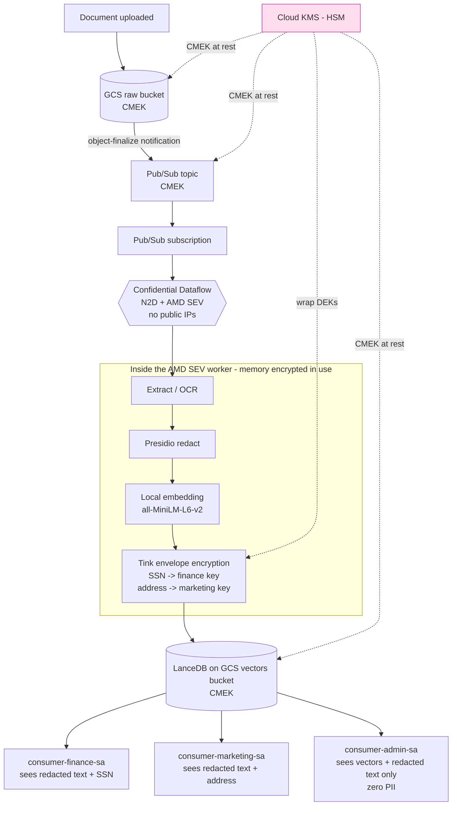
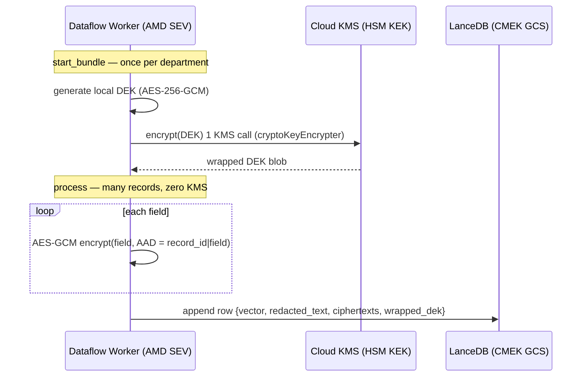
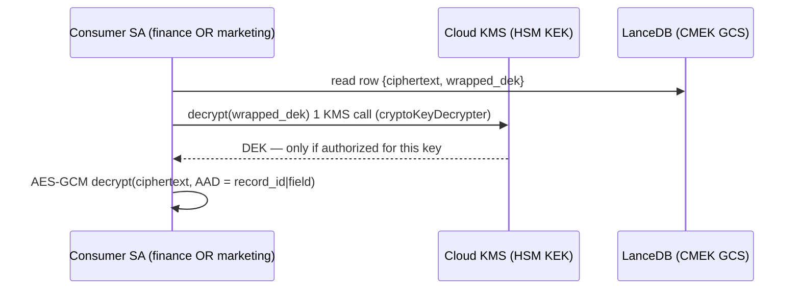

<div align="center">

# GCP AI Data Sovereignty

**A confidential, in-VPC streaming pipeline that redacts PII, embeds text locally, and applies per-department field-level encryption — encrypted at rest, in use, and per field.**


-FF6F00?style=for-the-badge)


-4285F4?style=flat-square&logo=googlecloud&logoColor=white)


</div>

---

This is a reference implementation demonstrating a "data never leaves the trust boundary" architecture on Google Cloud: encryption **at rest** (CMEK), **in use** (a Trusted Execution Environment on the ingestion path), and **per-field** with role-scoped access. Dropping a document into a bucket triggers a streaming pipeline that extracts text, redacts PII, embeds the redacted text with a local model, envelope-encrypts sensitive fields under per-department HSM keys, and writes everything to an object-store-native vector store — on Confidential VMs with no public IPs and no external egress. The entire estate is Terraform, deployed server-side via Infrastructure Manager.

> **Status:** verified end-to-end — documents flow from raw bucket to encrypted rows in LanceDB, with SSN sealed under the finance key and address under the marketing key.

---

## Table of Contents

- [Overview](#overview)
- [Architecture](#architecture)
- [End-to-End Data Flow](#end-to-end-data-flow)
- [Encryption Logic](#encryption-logic)
- [Key Design Decisions](#key-design-decisions)
- [GCP Services](#gcp-services)
- [Repository Structure](#repository-structure)
- [Quick Start](#quick-start)
- [Cost](#cost)
- [Troubleshooting](#troubleshooting)
  - [1. Deployer / IAM bootstrap](#1-deployer--iam-bootstrap)
  - [2. CMEK service-agent grants](#2-cmek-service-agent-grants)
  - [3. Worker-pool & launcher capacity](#3-worker-pool--launcher-capacity)
  - [4. Networking — Private Google Access](#4-networking--private-google-access)
  - [5. Build process](#5-build-process)
  - [6. Launcher process](#6-launcher-process)
  - [7. Worker process](#7-worker-process)
  - [8. Envelope encryption — worker denied useToDecrypt](#8-envelope-encryption--worker-denied-usetodecrypt)
  - [9. Log analysis & diagnostic command reference](#9-log-analysis--diagnostic-command-reference)

---

## Overview

Organizations with strict data-residency or confidentiality obligations (GDPR Art. 32, HIPAA, financial-services controls) often cannot use managed AI/embedding APIs, because doing so sends raw text outside their trust boundary. This project builds a document-processing and vectorization pipeline where sensitive content is **never exposed in the clear outside a hardware-isolated boundary**, and where even *within* the result store, different fields are only decryptable by the teams entitled to them.

Dropping a file into a raw bucket triggers a streaming pipeline that:

1. **Extracts** text (OCR for scanned documents, native parsing for PDFs/Office files).
2. **Redacts** PII (names, SSNs, addresses, phones, emails) with Presidio + spaCy NER.
3. **Embeds** the *redacted* text locally with a baked-in sentence-transformers model.
4. **Envelope-encrypts** selected sensitive fields with per-department keys (SSN under a finance key, address under a marketing key) using Google Tink.
5. **Writes** the vector, redacted text, and field ciphertexts to a vector store that lives directly on customer-managed-encrypted object storage.

All compute runs on Confidential N2D workers (AMD SEV — memory encrypted in use), with no public IPs and all dependencies and models baked into the container image so the workers make zero calls to the public internet.

---

## Architecture



### Three encryption layers

| Layer | Scope | Mechanism | Protects against |
|---|---|---|---|
| **At rest (CMEK)** | Whole bucket / topic | HSM KEK encrypts every byte written | Disk/storage compromise, Google operators |
| **In use (TEE)** | Ingestion/write path | AMD SEV memory encryption on N2D workers | Host/hypervisor inspection during processing |
| **Per-field (envelope)** | Individual PII fields | Tink AES-GCM with per-department DEKs wrapped by HSM KEKs | Over-broad access to the result store |

> **TEE boundary, stated precisely:** the AMD SEV protection covers the **write/ingestion path** (extraction → redaction → embedding → encryption). The **read/decrypt path** for downstream consumers is protected by per-key IAM and KMS Data Access audit logs, **not** a TEE (unless a given consumer also runs confidential compute). This distinction is intentionally not glossed over.

---

## End-to-End Data Flow

A single object upload produces a single encrypted row. Each stage runs inside the SEV-protected worker:

1. **Notify** — GCS emits an `OBJECT_FINALIZE` notification to the Pub/Sub topic; the streaming job reads it from the subscription.
2. **Fetch & extract** — the worker pulls the object into RAM, runs OCR/parsing, and emits one record (`record_id = <object-name>::<uuid>`).
3. **Redact** — Presidio detects entities and produces redacted text (safe to embed) plus the extracted `{ssn, address, ...}`.
4. **Embed** — the redacted text is embedded locally (`all-MiniLM-L6-v2`, 384-dim) — no managed API, no egress.
5. **Envelope-encrypt** — SSN is sealed under the finance DEK, address under the marketing DEK (see [Encryption Logic](#encryption-logic)).
6. **Write** — the row is appended to LanceDB on the CMEK vectors bucket.

**Row schema written to LanceDB:**

| Column | Type | Visibility |
|---|---|---|
| `record_id` | string | all |
| `vector` | fixed-size float list | all (admin-searchable) |
| `redacted_text` | string | all (no PII) |
| `encrypted_ssn` | binary (AES-GCM) | finance only |
| `encrypted_address` | binary (AES-GCM) | marketing only |
| `wrapped_dek_finance` | binary | unwrap needs finance KEK |
| `wrapped_dek_marketing` | binary | unwrap needs marketing KEK |

Verify rows landed:

```bash
gcloud storage ls gs://${PROJECT_ID}-vectors/lancedb/pii_store/pii_store.lance/data/
```

`.lance` fragments under `data/` mean the full path succeeded.

---

## Encryption Logic

The field-level layer is an **envelope-encryption** scheme designed around two constraints: the non-raisable HSM KMS operation quota, and a strict **encrypt-only worker** rule (the processor must be able to *seal* data it can never *read back*).

### The DEK / KEK envelope

- A **Data Encryption Key (DEK)** is generated **locally** (AES-256-GCM via Tink), once per department per worker bundle.
- The DEK is **wrapped once** by that department's HSM-backed Cloud KMS key (the **KEK**) with a single KMS `encrypt`. The wrapped blob is stored on every row.
- Fields are encrypted **locally** with the in-memory DEK — **no KMS round-trip per field**. This reuse is what keeps the pipeline under the HSM quota (e.g., 1000 records × 2 fields = 2000 field encryptions but only **2** KMS calls).
- Each ciphertext is bound to its `(record_id, field_name)` via AES-GCM **Additional Authenticated Data (AAD)**, so a ciphertext cannot be lifted from one record/field and replayed into another — decryption fails.

### Write path (worker, inside the TEE)



### Read path (consumer)



### The access matrix (enforced by key IAM, not application code)

| Identity | finance KEK | marketing KEK | Effective visibility |
|---|---|---|---|
| `dataflow-worker-sa` | **encrypt** | **encrypt** | can seal both; can read back **neither** |
| `consumer-finance-sa` | **decrypt** | — | redacted text + **SSN** |
| `consumer-marketing-sa` | — | **decrypt** | redacted text + **address** |
| `consumer-admin-sa` | — | — | vectors + redacted text, **zero PII** |

KMS Data Access audit logging is explicitly enabled (it is off by default), so every unwrap of an SSN or address is logged.

### Implementation note (why a subtle Tink call matters)

The wrap must be a **single explicit `encrypt`**. Tink's convenient `KeysetHandle.write(writer, master_aead)` encrypts the DEK keyset and then **verifies it by decrypting it again** before returning — which would force the worker to hold `cryptoKeyDecrypter` on the KEK and silently break the encrypt-only model. Instead, the DEK keyset is serialized in cleartext **in memory only** (it never leaves the SEV process) and wrapped with one `master_aead.encrypt()`; the consumer unwraps with one `master_aead.decrypt()`. See [Troubleshooting §8](#8-envelope-encryption--worker-denied-usetodecrypt).

---

## Key Design Decisions

**Vector store: LanceDB on GCS.** Chosen over Pinecone (data would leave the VPC — a non-starter for sovereignty) and FAISS (no incremental insert). LanceDB is object-store-native, so it lives directly on the CMEK vectors bucket (inheriting at-rest encryption) and supports streaming appends.

**Hand-rolled envelope, not `KmsEnvelopeAead`.** Tink's convenience primitive calls KMS once *per field*, blowing past the HSM quota under load. Owning the DEK lets us wrap once and reuse across many fields/records.

**Encrypt-only worker.** The processor holds `cryptoKeyEncrypter` on both field keys and `cryptoKeyDecrypter` on neither — it can seal data but never read it back. This is the core of the sovereignty guarantee.

**Confidential Dataflow.** Workers are N2D with `enable_confidential_compute`, giving AMD SEV memory encryption on the path that handles plaintext. The **launcher**, which only builds the graph and touches no PII, runs on a cheap non-confidential `e2` type.

**No public IPs + Private Google Access.** Workers reach Google APIs over Google's private backbone, never the public internet.

**Air-gapped image.** All Python dependencies, the spaCy model, and the embedding model are baked in at **build** time; at **run** time the workers are forced offline (`HF_HUB_OFFLINE=1`). The image is the single source of dependencies — no `--requirements_file` at launch.

---

## GCP Services

| Service | Role in this project |
|---|---|
| **Cloud KMS** | HSM-backed keys: one CMEK KEK + two per-department field KEKs |
| **Cloud Storage** | Raw / cleaned / vectors / dataflow buckets, all CMEK-encrypted |
| **Pub/Sub** | Carries GCS object-finalize notifications to the streaming job (CMEK) |
| **Dataflow** | Confidential streaming job via Flex Template (N2D + AMD SEV) |
| **Artifact Registry** | Hosts the worker/launcher container image (CMEK) |
| **Compute Engine** | Underlying N2D confidential workers + e2 launcher |
| **Cloud Build** | Builds and pushes the container image |
| **IAM** | Service accounts, a custom processor role, and the field-key access matrix |
| **Infrastructure Manager** | Runs Terraform server-side as a dedicated actuation SA |
| **Cloud Logging** | KMS Data Access audit logs + pipeline/launcher/worker diagnostics |

---

## Repository Structure

```
.
├── main.tf                     # Root module — composes all sub-modules
├── variables.tf                # Root input variables
├── outputs.tf                  # Root outputs (bucket names, SA emails, etc.)
├── terraform.tfvars            # Project-specific values (project_id, region, image tag…)
│
├── modules/
│   ├── kms/                    # Keyring + 3 HSM keys (KEK + 2 field keys)
│   ├── iam/                    # Service accounts + custom "sovereignAiProcessor" role
│   ├── gcs/                    # CMEK buckets + worker bucket IAM + GCS Pub/Sub publisher
│   ├── pubsub/                 # Topic, subscription, GCS finalize notification (CMEK)
│   ├── artifact_registry/      # CMEK container repo + pull access
│   ├── dataflow/               # Confidential Flex Template job + CMEK agent grants
│   ├── access_control/         # Field-level encryption matrix + KMS audit config
│   └── cloud_run/              # (retired earlier batch design — kept, not composed)
│
├── pipeline/
│   ├── main.py                 # Beam pipeline (Flex Template entrypoint)
│   ├── extract.py              # Text extraction / OCR
│   ├── pii.py                  # Presidio analyze + redact
│   ├── embed.py                # Local sentence-transformers embedding
│   ├── envelope_crypto.py      # Tink DEK/KEK envelope encryption helpers
│   ├── redaction_dofn.py       # EnvelopeEncryptFields DoFn
│   ├── lance_sink.py           # WriteToLanceDB DoFn
│   ├── test_envelope_crypto.py # Unit test for the crypto path (DEK reuse, AAD binding)
│   ├── Dockerfile              # Single launcher+worker image (deps + models baked in)
│   ├── requirements.txt        # Python deps (installed at BUILD time only)
│   └── metadata.json           # Flex Template parameter spec
│
└── scripts/
    └── build_flex_template.sh  # Build image + publish Flex Template spec
```

---

## Quick Start

> Examples use placeholders. Set them once:
>
> ```bash
> PROJECT_ID=<your-project-id>
> PROJECT_NUMBER=<your-project-number>
> REGION=us-central1
> IMAGE=${REGION}-docker.pkg.dev/${PROJECT_ID}/sovereign-ai/pii-scrubber:v1
> ```

### 0. Prerequisites (one-time deployer bootstrap)

Infrastructure Manager runs Terraform server-side as a dedicated actuation service account, which cannot fully bootstrap its own permissions. Granted out-of-band before the first deploy:

- Enable `config.googleapis.com`; create `infra-manager-sa@${PROJECT_ID}.iam.gserviceaccount.com`.
- Grant it the admin roles to create resources (KMS, Storage, Pub/Sub, IAM, Dataflow, Artifact Registry, Service Usage, Logging), **plus** `roles/config.agent` (state backend) and `roles/iam.serviceAccountUser` **scoped to the worker SA** (see Troubleshooting §1).
- Enable **Private Google Access** on the worker subnet (see Troubleshooting §4).

### 1. Build the container image

```bash
gcloud builds submit ./pipeline --tag "$IMAGE" --project "$PROJECT_ID" --timeout=1800s
```

### 2. Publish the Flex Template spec

```bash
gcloud dataflow flex-template build \
  gs://${PROJECT_ID}-dataflow/templates/pii-scrubber.json \
  --image "$IMAGE" --sdk-language PYTHON \
  --metadata-file ./pipeline/metadata.json --project "$PROJECT_ID"
```

### 3. Configure `terraform.tfvars`

```hcl
project_id             = "<your-project-id>"
project_number         = "<your-project-number>"
region                 = "us-central1"
dataflow_template_spec = "gs://<your-project-id>-dataflow/templates/pii-scrubber.json"
```

### 4. Deploy via Infrastructure Manager

```bash
SA=infra-manager-sa@${PROJECT_ID}.iam.gserviceaccount.com

gcloud infra-manager deployments apply \
  projects/${PROJECT_ID}/locations/${REGION}/deployments/sovereign-ai \
  --service-account="projects/${PROJECT_ID}/serviceAccounts/${SA}" \
  --local-source="." \
  --input-values="project_id=${PROJECT_ID},project_number=${PROJECT_NUMBER},region=${REGION}"
```

A successful apply ends with the streaming job in `Running`.

### 5. Test end-to-end

```bash
gcloud storage cp sample.txt gs://${PROJECT_ID}-raw/ --project "$PROJECT_ID"
gcloud storage ls gs://${PROJECT_ID}-vectors/lancedb/pii_store/pii_store.lance/data/
```

---

## Cost

This is a **cost-optimized POC**, but the dominant cost is a streaming job, so know what runs 24/7:

| Driver | Notes |
|---|---|
| **Dataflow streaming worker** | The main cost. 1× `n2d-standard-2` + Streaming Engine runs continuously while the job is up. **Drain the job when not testing** to avoid idle charges. |
| **Launcher VM** | Cheap `e2-standard-2`, transient — only alive during launch. |
| **Cloud KMS (HSM)** | Small per-key monthly fee × 3 keys + per-operation. The DEK-reuse design keeps operations minimal. |
| **Cloud Storage** | Negligible at POC scale (raw docs + LanceDB dataset). |
| **Artifact Registry** | One container image; minimal. |

> **POC tip:** `gcloud dataflow jobs drain <JOB_ID> --region=$REGION` when idle. At rest (no running job) the standing cost is just KMS keys + a little storage — near zero.

---

## Troubleshooting

This pipeline touches Confidential VMs, CMEK, private networking, custom containers, and a server-side Terraform runner — so failures tend to be in the *integration* between those. Each class below is one that was actually hit, with symptom, root cause, and fix.

> **Mental model for Dataflow Flex Template failures.** Failures peel back in layers:
> **(1) Terraform/IAM** → **(2) launcher VM start** (CMEK disk, capacity) → **(3) launcher container** (graph, dependency staging) → **(4) worker pool start** (image pull, network) → **(5) per-element processing** (your DoFns).
> A failure in **3 s** is layer 1–2; **6 min** is layer 3; **14 min** is layer 3–4; a job that stays **Running but writes nothing** is layer 5. The longer it runs before failing, the deeper (and closer to done) you are.

### 1. Deployer / IAM bootstrap

**Symptom:** `cannot act as service account ... (iam.serviceAccounts.actAs)`, or a 403 on the state backend.

**Cause:** Launching a job that *runs as* the worker SA requires `iam.serviceAccounts.actAs` on that SA. `roles/iam.serviceAccountAdmin` does **not** include it — `actAs` comes from `roles/iam.serviceAccountUser`. The state 403 is missing `roles/config.agent`.

```bash
gcloud iam service-accounts add-iam-policy-binding \
  dataflow-worker-sa@${PROJECT_ID}.iam.gserviceaccount.com \
  --member="serviceAccount:infra-manager-sa@${PROJECT_ID}.iam.gserviceaccount.com" \
  --role="roles/iam.serviceAccountUser" --project="$PROJECT_ID"
```

> The actuation SA's own permissions are a bootstrap concern — they can't be self-applied by the deployment they enable, so they live as documented prerequisites, not in Terraform.

### 2. CMEK service-agent grants

**Symptom:** `Cloud KMS error ... Permission 'cloudkms.cryptoKeyVersions.useToEncrypt' denied`, as the launcher VM fails to start.

**Cause:** Each service that encrypts with your CMEK key needs *its own* Google-managed service agent to hold `cryptoKeyEncrypterDecrypter`. Dataflow needs **two** easy-to-miss agents: **Compute Engine** (`service-${PROJECT_NUMBER}@compute-system…`, VM disks) and **Dataflow** (`service-${PROJECT_NUMBER}@dataflow-service-producer-prod…`, job state). GCS, Pub/Sub, and Artifact Registry agents need the same on their CMEK resources.

**Fix:** In Terraform (the `dataflow` module grants both agents and the job `depends_on` those bindings).

> Never bind a service-agent email before it exists — provision with `google_project_service_identity` and grant *after*.

### 3. Worker-pool & launcher capacity

**Symptom:** `RESOURCE_EXHAUSTED [ZONE_RESOURCE_POOL_EXHAUSTED] ... does not have enough resources available`, often on the **launcher VM** at ~17 s.

**Cause:** Physical capacity, **not** quota — confidential N2D was momentarily unavailable in the zone. A quota increase does nothing.

**Fix:**

1. **Retry** — it's transient and often clears within minutes.
2. **Keep the launcher off N2D.** `enable_confidential_compute` is a job-wide option, so without an explicit launcher type the launcher gets placed on scarce confidential N2D and competes with the workers. The launcher only builds the graph (no PII), so pin it to abundant `e2`:
   ```hcl
   launcher_machine_type = "e2-standard-2"   # in the flex template job block
   ```
3. Let Dataflow place workers **region-wide** rather than pinning a single zone.

### 4. Networking — Private Google Access

**Symptom:** Launcher VM creates then is torn down repeatedly; **nothing** written to the launcher's GCS staging path; job fails ~6 min with "Failed to read the result file."

**Cause:** Workers have **no public IP**. Without **Private Google Access** on the subnet, a private VM cannot reach Google APIs — no image pull, no logs, no results.

```bash
gcloud compute networks subnets update default \
  --region="$REGION" --enable-private-ip-google-access --project="$PROJECT_ID"
```

### 5. Build process

The image is built on **Cloud Build** (which has internet); all deps and models are installed/baked **at build time**.

- **CPU-only torch:** `sentence-transformers` pulls CUDA `torch` (~2 GB unused). Install CPU torch first (`pip install torch --index-url https://download.pytorch.org/whl/cpu`) to keep the image lean.
- **Build timeout:** the image is large; use `--timeout=1800s`.

### 6. Launcher process

**Symptom:** Job runs ~14 min, then "Template launch failed." The launcher console log shows a `pip download` against `pypi.org` failing with `Network is unreachable`.

**Cause:** `FLEX_TEMPLATE_PYTHON_REQUIREMENTS_FILE` makes the launcher pass `--requirements_file`, which re-downloads dependencies from PyPI at launch. The custom image already has them, and the private launcher can't reach PyPI.

**Fix:** Do **not** set `FLEX_TEMPLATE_PYTHON_REQUIREMENTS_FILE`. Bake the embedding model too (PGA does not cover Hugging Face):

```dockerfile
ENV HF_HOME=/opt/hf-cache
ENV SENTENCE_TRANSFORMERS_HOME=/opt/hf-cache
RUN python -c "from sentence_transformers import SentenceTransformer; \
    SentenceTransformer('sentence-transformers/all-MiniLM-L6-v2')"
ENV HF_HUB_OFFLINE=1
ENV TRANSFORMERS_OFFLINE=1
```

The launcher console log (authoritative for launch failures):

```bash
gcloud storage cat gs://${PROJECT_ID}-dataflow/staging/template_launches/<JOB_ID>/console_logs
```

If empty, the launcher had no network to write it (see §4).

### 7. Worker process

**Symptom:** Job reaches `Running`, but documents never appear in LanceDB; the table is created (`_versions/`, `_transactions/`) with **no `data/` directory**.

**Cause:** Streaming jobs **retry failing elements indefinitely**, so the job stays `Running` while an element loops on a DoFn exception. No row is committed. (The real instance of this here was the envelope-encrypt KMS denial — see §8.)

```bash
gcloud logging read \
  'resource.type="dataflow_step" AND resource.labels.job_id="<JOB_ID>" AND severity>=ERROR' \
  --project="$PROJECT_ID" --limit=50 --freshness=1h \
  --format="value(timestamp,jsonPayload.message,textPayload)"
```

The job graph shows which stage has elements going **in** but not **out** — that's the throwing DoFn; the worker log names the exception.

### 8. Envelope encryption — worker denied `useToDecrypt`

**Symptom:** Worker logs repeat `PermissionDenied: cloudkms.cryptoKeyVersions.useToDecrypt` on a **field key**; job stays `Running`, table is empty (a §7 retry loop).

**Cause:** The DEK wrap used Tink's `KeysetHandle.write(writer, master_aead)`, which encrypts the keyset and then **verifies it by decrypting it again** before returning. That verify-decrypt forces the worker to hold `cryptoKeyDecrypter` on the KEK.

**The wrong fix:** granting the worker decrypt. It "works" but silently breaks the model — the processor could then read back every field it ever sealed. **Do not do this.**

**The right fix:** wrap with a single explicit `encrypt`, no verify round-trip:

```python
# WRONG — Tink verifies the wrap by decrypting, forcing cryptoKeyDecrypter on the worker:
# dek_handle.write(tink.BinaryKeysetWriter(buf), self._master)

# RIGHT — serialize the DEK keyset in cleartext (in memory only), wrap with ONE encrypt:
buf = io.BytesIO()
cleartext_keyset_handle.write(tink.BinaryKeysetWriter(buf), dek_handle)
wrapped = self._master.encrypt(buf.getvalue(), b"")   # single KMS encrypt
```

The consumer unwraps with `self._master.decrypt(wrapped, b"")` — gated by `cryptoKeyDecrypter`, which only the department consumer holds. The worker now needs **only** `cryptoKeyEncrypter`, preserving the encrypt-only guarantee.

### 9. Log analysis & diagnostic command reference

| Question | Where to look |
|---|---|
| Why did the **launch** fail? | Launcher console log in GCS (§6) |
| Why did the **launcher VM** not start? | `resource.type="gce_instance"` + launcher name |
| Why did the **job** fail at a high level? | `logName=".../dataflow.googleapis.com%2Fjob-message"` |
| Why is an **element** failing? | `resource.type="dataflow_step"` worker logs (§7) |
| Did Terraform fail? | Infra Manager apply build log in the deployment's GCS logs path |

**Obtain logs**

```bash
gcloud logging read \
  'logName="projects/'"$PROJECT_ID"'/logs/dataflow.googleapis.com%2Fjob-message"
   AND resource.labels.job_id="<JOB_ID>" AND severity>=WARNING' \
  --project="$PROJECT_ID" --limit=100 --freshness=4h \
  --format="value(timestamp,severity,textPayload)"
```

**Check job status**

```bash
gcloud dataflow jobs list --region="$REGION" --project="$PROJECT_ID" --status=active
gcloud dataflow jobs show <JOB_ID> --region="$REGION" --project="$PROJECT_ID"
```

**Check the deployment**

```bash
gcloud infra-manager deployments describe \
  projects/${PROJECT_ID}/locations/${REGION}/deployments/sovereign-ai \
  --format="value(state)"     # IN_PROGRESS locks further applies; wait for FAILED/ACTIVE
```

**Check identity & IAM**

```bash
gcloud auth list
gcloud projects get-iam-policy "$PROJECT_ID" \
  --flatten="bindings[].members" \
  --filter="bindings.members:dataflow-worker-sa@${PROJECT_ID}.iam.gserviceaccount.com" \
  --format="table(bindings.role)"
gcloud kms keys get-iam-policy pii-field-finance \
  --keyring=sovereign-ai-keyring --location="$REGION" --project="$PROJECT_ID"
```

**Verify services / CMEK / networking**

```bash
gcloud services list --enabled --project="$PROJECT_ID" \
  --filter="config.name:(dataflow.googleapis.com OR cloudkms.googleapis.com OR \
    pubsub.googleapis.com OR artifactregistry.googleapis.com OR compute.googleapis.com OR \
    config.googleapis.com)"

gcloud compute networks subnets describe default --region="$REGION" \
  --project="$PROJECT_ID" --format="value(privateIpGoogleAccess)"

gcloud storage buckets describe gs://${PROJECT_ID}-vectors --format="value(default_kms_key)"
```

---

## Notes & Limitations

- This is a **proof-of-concept / reference architecture**, not a hardened production system.
- Presidio's address (`LOCATION`) detection is approximate; a custom regex `PatternRecognizer` for street/zip is the recommended next step for clean address redaction.
- Ingestion is **not idempotent**: `record_id` includes a random UUID and the sink appends, so reprocessing the same object creates a new row. Production would use a deterministic ID (object name + GCS generation) and an upsert/merge keyed on it.
- Network isolation currently uses the default subnet; production should use a dedicated VPC with explicit Dataflow firewall rules in Terraform.
- The retired `cloud_run` module is left in the tree for reference and is not composed by the root module.

---

## Author

**Robert Okolotowicz**
AI Security Architect
[LinkedIn](https://www.linkedin.com/in/robert-okolotowicz/) · [GitHub](https://github.com/rokolotowicz)

---

## License

MIT
